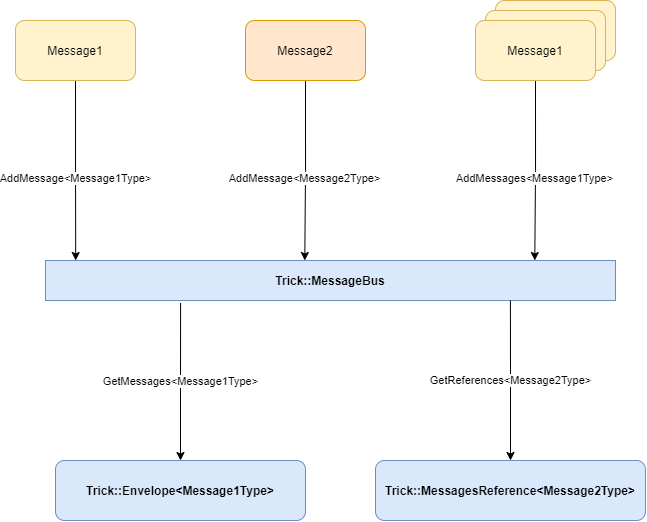
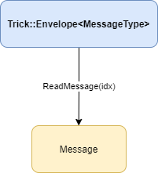
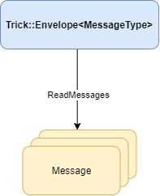

# Trick::MessageBus (C++)

**Simple Message Bus for exchanging application wide data without strong coupling C++ between instances.** In case you need to exchange data between instances in your application, but you do not want to extend the API of these instances, to stay simple and decoupled. 

## What's the idea behind it

Let's say you want to exchange data between instances, but without the need to force additional methods, or the instance to which you want to transfer data has not been created yet. In that case, you can use "MessageBus" to pass data between instances with the ability to keep full decoupling between these instances.

## How it works

Trick::MessageBus allows to place messages which can later be read by copy or by reference for any other instance that has access to Trick::MessageBus.

### Example of usage

This is basic example of usage. Multiple sources can put different messages on single Trick::MessageBus. Trick::MessageBus distinguishes messages by their type. Other instances can read messages by coping them, or reading reference to this messages. Reading reference to messages reduce memory footprint but also if messages are deleted from Trick::MessageBus reference will not be able to point to this messages anymore.

Trick::Envelope might contain copies of messages read from message bus. Below is example of usage.

